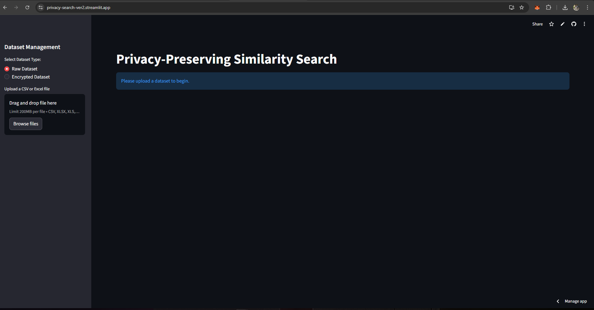
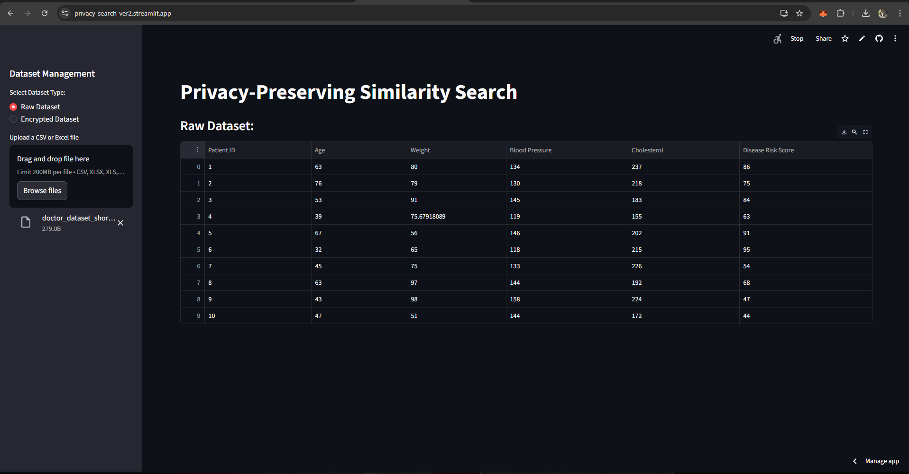
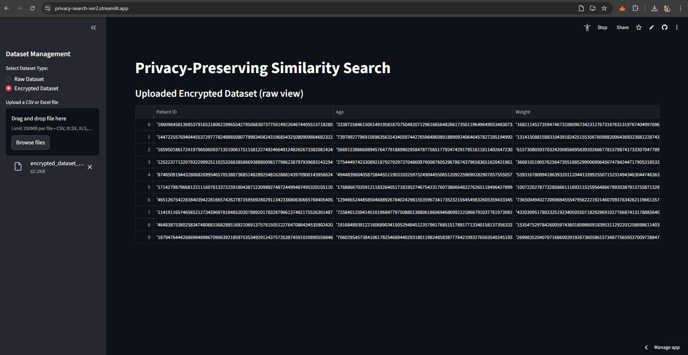
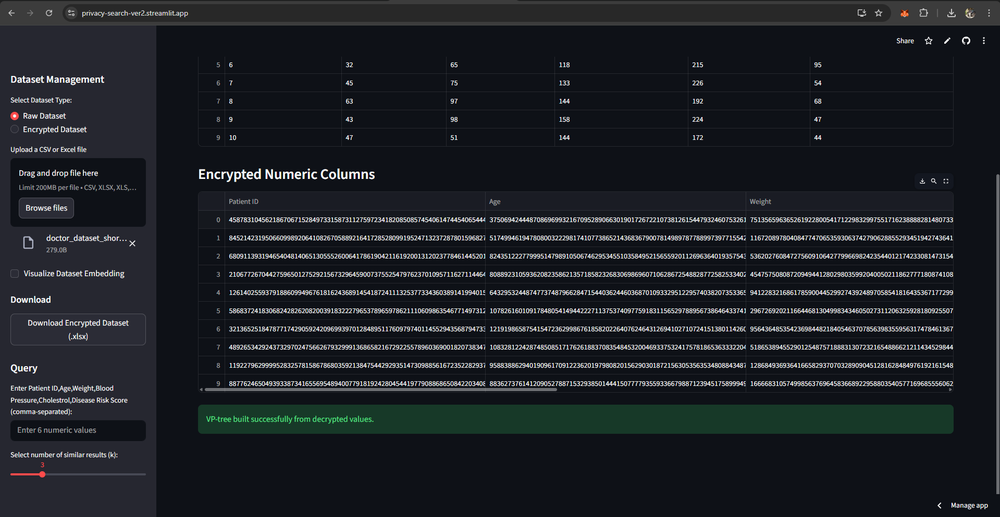
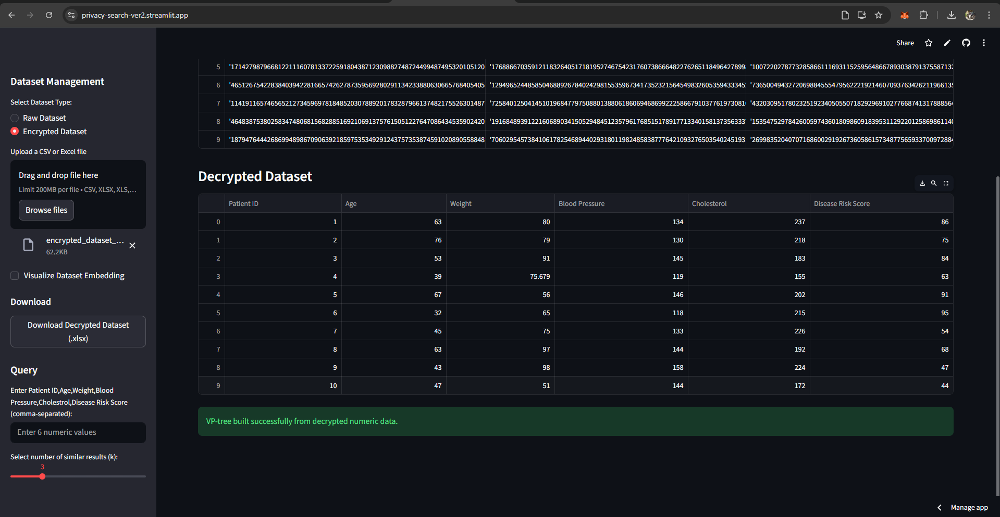
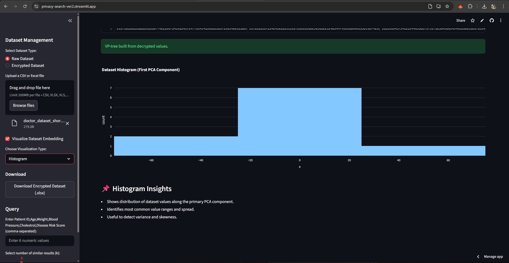
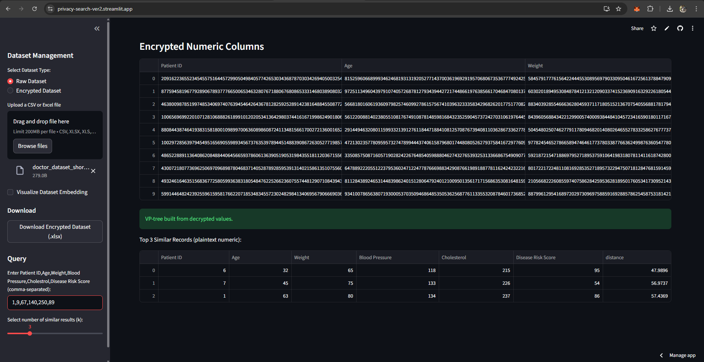

# 🔐 Privacy-Preserving Similarity Search (Updated Version)

A secure cloud-based similarity search system that protects sensitive data using **Paillier Homomorphic Encryption**.  

This updated version introduces **two operational modes**:

- 🟢 **Raw Dataset Mode**
- 🔵 **Encrypted Dataset Mode**

The system allows users to encrypt datasets, download encrypted files with keys, re-upload them later, decrypt securely, and perform similarity searches — all through an interactive **Streamlit UI**.

---

## 📌 Project Overview

Traditional cloud-based similarity search exposes raw data to servers.  
This project ensures:

- Data remains encrypted before storage
- Secure encrypted dataset sharing
- Controlled decryption only when key is provided
- Privacy-preserving similarity search
- Downloadable encrypted and decrypted datasets

The encrypted dataset generated in **Raw Mode** can be reused in **Encrypted Mode** for decryption and further similarity analysis.

---

## 🚀 Key Features

### 🟢 Raw Dataset Mode
- Upload CSV / Excel dataset
- Automatic detection of numeric columns
- Generate Paillier public & private keys
- Encrypt numeric columns
- Display encrypted data preview
- Download encrypted dataset (with embedded key)
- Perform similarity search
- Download decrypted dataset

### 🔵 Encrypted Dataset Mode
- Upload previously downloaded encrypted dataset
- Extract embedded encryption keys
- Decrypt numeric columns
- Reconstruct original dataset
- Perform similarity search
- Download decrypted dataset

---

## 🔐 Security Advantages

- End-to-end encryption of numeric data
- Private key stored securely within exported file
- Cloud cannot access plaintext data
- Secure similarity computation workflow
- Logging of search operations for auditing
- Data confidentiality maintained during storage & processing

---

## 🧠 How It Works

1. User uploads raw dataset.
2. System generates Paillier key pair.
3. Numeric columns are encrypted.
4. Encrypted dataset + keys are exported as `.xlsx`.
5. User can re-upload encrypted dataset later.
6. System extracts keys and decrypts numeric values.
7. Similarity search is performed on reconstructed dataset.
8. Results are displayed securely to the user.

---

## 📦 Technologies Used

- Python
- Streamlit
- Paillier Homomorphic Encryption (`phe`)
- NumPy
- Pandas
- SciPy
- scikit-learn (PCA)
- Plotly
- OpenPyXL
- Python Logging Module

---

## 📂 Project Structure
```
Privacy-Preserving_Similarity_Search-Updated/
│
├── privacy_similarity_app.py
├── privacy_search.log  (auto-generated)
├── README.md

```
---

## ⚙️ Installation

### 1️⃣ Clone Repository
```
git clone https://github.com/Sheikh-13/Privacy-preserving_Similarity_Search-Updated-.git
cd Privacy-preserving_Similarity_Search-Updated-
```

### 2️⃣ Install Dependencies
```
pip install streamlit numpy pandas scipy scikit-learn plotly phe openpyxl
```

---

## ▶️ Run the Application
```
streamlit run app4.py
```

Open the URL shown in the terminal (usually `http://localhost:8501`).

---
## 📸 Snapshots

<div align="center">

###  **Home/Initial Interface**
*Dataset Upload Page*



###  **Dataset Preview Page in Raw Dataset Mode**
*Preview Raw Dataset before Encryption*



###  **Dataset Preview Page in Encrypted Dataset Mode**
*Preview Encrypted Dataset before Decryption*



###  **Encryption Visualization page in Raw Dataset Mode**
*Visaualize Encrypted Dataset in a Numeric Column along with message "VP-Tree Successfully built"*



###  **Decryption Visualization page in Encrypted Dataset Mode**
*Visaualize Decrypted Dataset in a Numeric Column along with message "VP-Tree Successfully built"*



###  **Dataset Embedding Visualization**
*A 2D PCA-reduced scatter plot where each point corresponds to a dataset record*


*The Histogram shows thefrequency distribution of reduced dataset values*



###  **Query Input and Similarity Search Results**
*Query Entry and Selection of Number of similar results(k)*




---
</div>

---
## 📊 Applications

- 🏥 Healthcare record comparison
- 💳 Financial fraud detection
- 🛍️ Privacy-preserving recommendation systems
- 🔐 Secure biometric matching
- ☁️ Confidential cloud data outsourcing

---

## 📈 Future Improvements

- Fully encrypted similarity computation (without decryption)
- Multi-user authentication system
- AES-protected key storage
- Cloud deployment (AWS / GCP / Azure)
- Performance optimization for large datasets

---

## 📝 Logging

Similarity search operations are recorded in:

privacy_search.log


This file is automatically generated after the first search operation.

---

## 👨‍💻 Author

**Sheikh Tauheed**  
Computer Science Engineering  
Interests: Cybersecurity | AI | Cloud Computing | IoT | Data Analytics

---

## ⭐ Support

If you found this project useful, please consider giving it a ⭐ on GitHub.
